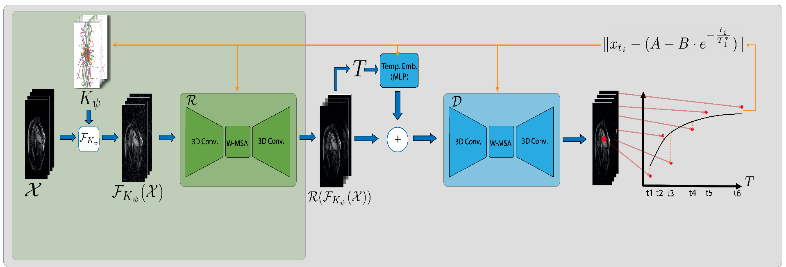

# T1-PILOT: Optimized Trajectories for T1 Mapping Acceleration

Official PyTorch implementation of [**T1-PILOT: Optimized Trajectories for T1 Mapping Acceleration**](https://arxiv.org/abs/2502.20333)  
Tamir Shor, Moti Freiman, Chaim Baskin, and Alex Bronstein  
Technion – Israel Institute of Technology | Ben-Gurion University | IST Austria

Presented at **ESMRMB 2025**


---

## Overview

T1-PILOT is a physics-informed deep learning framework for accelerated cardiac T1 mapping. It jointly learns non-Cartesian k-space trajectories, image reconstruction, and T1-decay modeling, while enforcing scanner-feasible physical constraints.

Training proceeds in three stages:
1. Reconstruction-guided trajectory pretraining  
2. Decay-aware trajectory optimization  
3. Per-sample finetuning

---

## Dataset: CMRxRecon Challenge

We use the CMRxRecon Challenge dataset. Follow the official download instructions at: `https://cmrxrecon.github.io/`.

After downloading, an example folder structure should look like:  
`<path_to_CMRxRecon>/`  
` ├── SingleCoil/`  
`   Mapping   
      ├── TrainingSet/`  
` │   └── ValidationSet/`  
    Cine   
      ├── TrainingSet/`  
` │   └── ValidationSet/`  
` └── MultiCoil/`

Use the `SingleCoil` data for the experiments in the paper unless you explicitly want multi-coil settings.

---

## Repository setup

1. Clone and enter the project: `git clone https://github.com/<your-org>/T1-PILOT.git && cd T1-PILOT`  
2. Install conda environment with supplied environment yaml file.
---

## Training pipeline (commands are single-line; replace placeholders)

> Replace `<path_to_CMRxRecon>`, `<path_to_CMRxRecon_phase1>`, `<path_to_CMRxRecon_training_set>`, `<n_shots>`, `<path_to_pretrained_reconstruction_model_from_stage3>`, and `<path_to_pretrained_decay_model_from_stage4>` with your actual paths and chosen shot count.

### Reconstruction finetuning stage — run:
`python pretrained_tp.py --data-path <path_to_CMRxRecon_phase1> --batch-size 16 --report-interval 20 --n-shots <n_shots> --sub-lr 0.01 --trajectory-learning --lr 0.0001 --num-epochs 1000 --checkpoint team_pilot_rec_checkpoint/9_frames_<n_shots>/summary/test/best_model.pt --resume  --single_traj <False by default, pass flag to recreate single-traj baseline> --initialization <radial, or golden for GAR baseline> --trajectory-learning <True, unless you want to use frozen trajectories>`

This initializes the reconstruction model (`Rζ`) and learns physically feasible per-frame k-space trajectories.

### Decay model training (joint reconstruction + subsampling) — run:
`python pretrained_tp_w_decay.py --data-path <path_to_CMRxRecon_training_set> --resume --checkpoint <path to reconstruction checkpoint> --checkpoint-decay <path_to_decay_checkpoint_from_previous_stage> --batch-size 16 --num-epochs 1000 --lr 5e-05 --lr-step-size 300 --lr-gamma 1 --weight-decay 0.0 --sub-lr 0.005 --sub-lr-time 300 --trajectory-learning <True, unless you want to use frozen trajectories> --acc-weight 0.01 --vel-weight 0.1 --rec-weight 1  --initialization <radial, or golden for GAR baseline>  --n_shots <n_shots> --single_traj <False by default, pass flag to recreate single-traj baseline> --embedding_dim 144 --embedding_lr 0.0005 --opt_decay True`


### Per-sample finetuning (stage 3) — run:
`python eval_pretrained_per_sample.py --data-path <path_to_CMRxRecon> --lr 0.0001 --embedding-dim 144 --n-shots <n_shots> --opt-decay --opt-rec --num-epochs 3000 --report-interval 100 --embedding-lr 0.001 --checkpoint-rec <path_to_pretrained_reconstruction_model_from_stage3> --checkpoint-decay <path_to_pretrained_decay_model_from_stage4> --resume`

This refines the decay and reconstruction parameters per sample and is optional but recommended to match the paper's per-sample finetuning step.

---


## Citation


```bibtex
@article{shor2025t1,
  title={T1-PILOT: Optimized Trajectories for T1 Mapping Acceleration},
  author={Shor, Tamir and Freiman, Moti and Baskin, Chaim and Bronstein, Alex},
  journal={arXiv preprint arXiv:2502.20333},
  year={2025}
}
